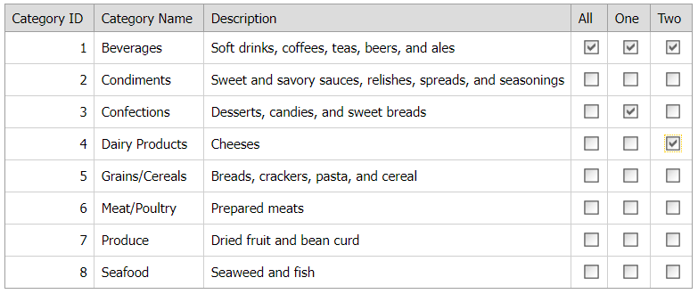

# Grid View for ASP.NET Web Forms - How to implement the Select All functionality in a row
<!-- run online -->
**[[Run Online]](https://codecentral.devexpress.com/e4551/)**
<!-- run online end -->

This example demonstrates how to add check box editors to templated columns and change their selection state to emulate the Select All functionality.



## Overview

Follow the steps below to implement the Select All functionality in a row:

1. Add check box columns to the grid, specify a column's [DataItemTemplate](https://docs.devexpress.com/AspNet/DevExpress.Web.GridViewDataColumn.DataItemTemplate) property,and add a check box editor to the template.

    ```aspx
    <dx:GridViewDataCheckColumn Caption="All">
        <DataItemTemplate>
            <dx:ASPxCheckBox ID="chbAll" runat="server" OnInit="chbAll_Init" />
        </DataItemTemplate>
    </dx:GridViewDataCheckColumn>
    <dx:GridViewDataCheckColumn Caption="One">
        <DataItemTemplate>
            <dx:ASPxCheckBox ID="chb1" runat="server" OnInit="chb_Init" />
        </DataItemTemplate>
    </dx:GridViewDataCheckColumn>
    <dx:GridViewDataCheckColumn Caption="Two">
        <DataItemTemplate>
            <dx:ASPxCheckBox ID="chb2" runat="server" OnInit="chb_Init" />
        </DataItemTemplate>
    </dx:GridViewDataCheckColumn>
    ```

2. For all check box editors, handle their server-side `Init` events. In handlers, access an editor's template container and get the container's visible index. Based on that visible index, specify an editor's `ClientInstanceName` property and handle the client-side [CheckedChanged](https://docs.devexpress.com/AspNet/js-ASPxClientCheckBox.CheckedChanged) event.

    ```csharp
    protected void chbAll_Init(object sender, EventArgs e) {
        ASPxCheckBox chb = sender as ASPxCheckBox;
        GridViewDataItemTemplateContainer container = chb.NamingContainer as GridViewDataItemTemplateContainer;
        chb.ClientInstanceName = String.Format("chbAll{0}", container.VisibleIndex);
        chb.ClientSideEvents.CheckedChanged = String.Format("function (s, e) {{ OnAllCheckedChanged(s, e, {0}); }}", container.VisibleIndex);
    }

    protected void chb_Init(object sender, EventArgs e) {
        ASPxCheckBox chb = sender as ASPxCheckBox;
        GridViewDataItemTemplateContainer container = chb.NamingContainer as GridViewDataItemTemplateContainer;
        chb.ClientInstanceName = String.Format("{0}{1}", chb.ID, container.VisibleIndex);
        chb.ClientSideEvents.CheckedChanged = String.Format("function (s, e) {{ OnCheckedChanged(s, e, {0}); }}", container.VisibleIndex);
    }
    ```

3. In `CheckedChanged` event handlers, use [GetChecked](https://docs.devexpress.com/AspNet/js-ASPxClientCheckBox.GetChecked) and [SetChecked](https://docs.devexpress.com/AspNet/js-ASPxClientCheckBox.SetChecked(isChecked)) methods to change an editor's selection state.

    ```js
    function OnAllCheckedChanged(s, e, index) {
        for (var i = 1; i < 3; i++) {
            var chb = eval("chb" + i + index);
            chb.SetChecked(s.GetChecked());
        }
    }
    
    function OnCheckedChanged(s, e, index) {
        var all = eval("chbAll" + index);
        var isAllChecked = true;
        for (var i = 1; i < 3; i++) {
            var chb = eval("chb" + i + index);
            if (!chb.GetChecked())
                isAllChecked = false;
        }
        all.SetChecked(isAllChecked);
    }
    ```

## Files to Review

* [Default.aspx](./CS/WebSite/Default.aspx) (VB: [Default.aspx](./VB/WebSite/Default.aspx))
* [Default.aspx.cs](./CS/WebSite/Default.aspx.cs) (VB: [Default.aspx.vb](./VB/WebSite/Default.aspx.vb))
